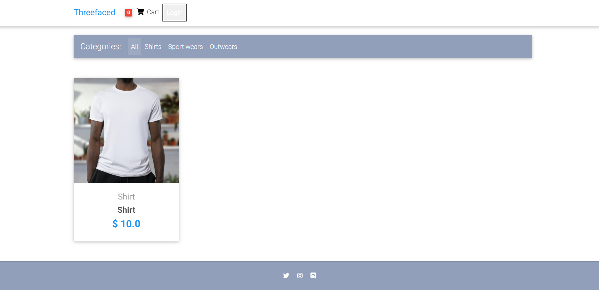
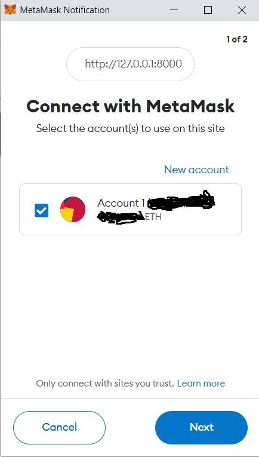
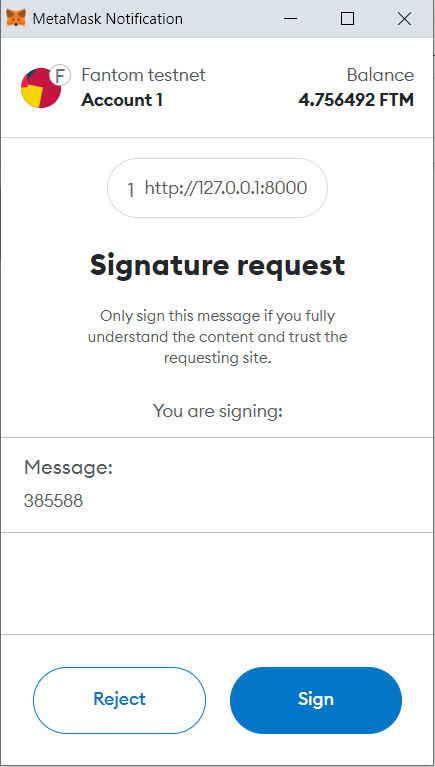
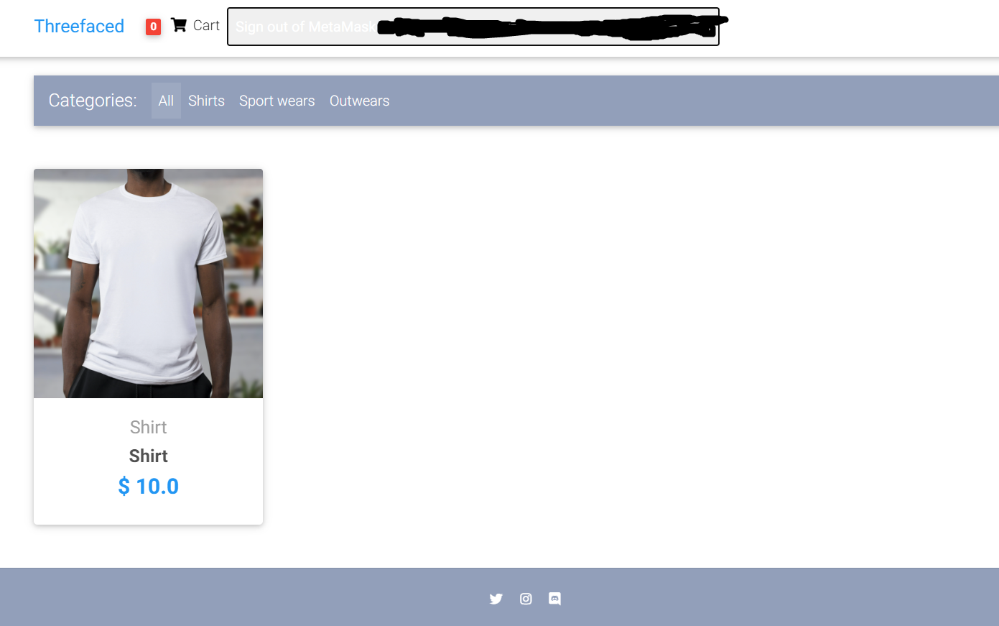
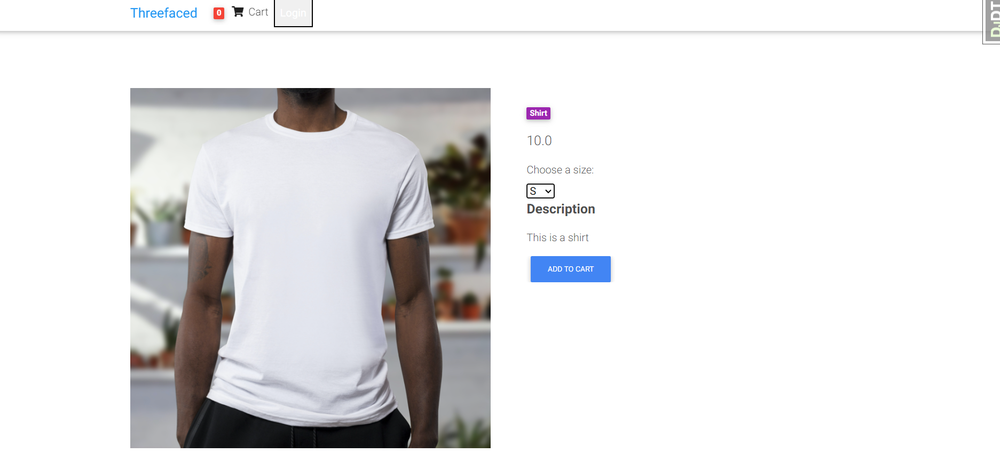
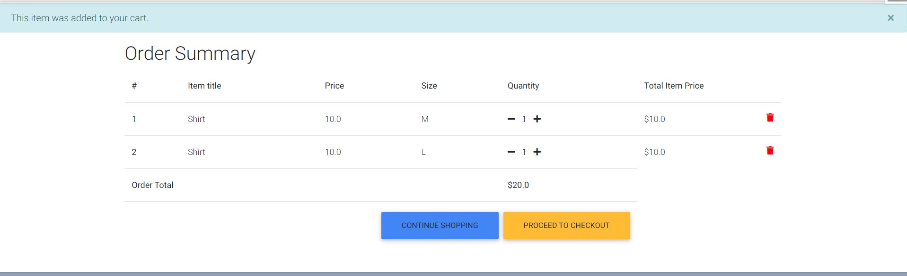
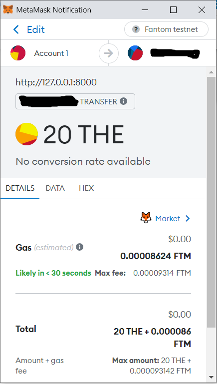

# ERC20-Token-E-Commerce-Shop

> I built an E commerce shop where the payment works exclusively with MetaMask. The reason, why I built it, was, that I was part of a team which planned to bring out a shop where people can only buy with our own ERC20-Token. My foundation therefore was a almost ready e commerce shop, which you can find here: https://github.com/justdjango/django-ecommerce/tree/master/djecommerce
I didn't change very much on the style. I simplified it more. I deleted all the classic payment stuff and some other extra features. The goal was to have an absolutely basic merch shop. I won't explain the whole structure of the shop because there is already the repo for it. I will show more detailed how I implemented the Meta mask payment and login process. The login is similar like in OpenSea e.g. But it is a bit more complicated.

## Table of Contents
* [General Info](#general-information)
* [Technologies Used](#technologies-used)
* [Features](#features)
* [Screenshots](#screenshots)
* [Setup](#setup)
* [Project Status](#project-status)
* [Room for Improvement](#room-for-improvement)
* [Acknowledgements](#acknowledgements)
* [Contact](#contact)

## General Information

It shows an online shop where you can login only with your MetaMask wallet and pay with it. 
The login function works with a signature process like in https://www.quicknode.com/guides/web3-sdks/how-to-build-a-one-click-sign-in-using-metamask-with-phps-laravel.
You need to dive a bit deeper into Web3 development before to understand how it all works. The goal of the shop was to sell merch of an NFT project. This merch should be paid with ERC20-Tokens. 
To be eligible to buy merch you needed to possess an NFT of this specific NFT project. The whole login system needed to be adapted because you don't login with username + password. 
So the standard authentification of Django needed to be changed.

## Technologies Used
- Python
- Django
- HTML
- CSS
- JavaScript
- Web3

## Features

- login with MetaMask wallet
- pay with ERC20-Tokens
- get order emails
- cart

## Screenshots

The first screenshot shows the main page where all products are listed (in this case one T-Shirt).

If you click on the Login-Button you will need to connect your MetaMask-Wallet with the web page. It's similar like in OpenSea. You just need to connect your wallet the first time you login.

For every login process you need to sign a signature. The signature process is like in: https://www.quicknode.com/guides/web3-sdks/how-to-build-a-one-click-sign-in-using-metamask-with-phps-laravel

After you logged in successfully, you will see, that the content of the login button changed. If you click on it, you can sign out.

If you click on the product on the main page, you will get to the product page. Here you can choose the size of the T-Shirt and add it to your cart.

In the cart you can see your whole order. Here you can decide the number of shirts as well.

If you want to checkout you need to specify your address.

The last process is the payment. The payment runs over MetaMask. As mentioned, you pay with ERC20-Tokens. The amount for your order is sent to the contract of the ERC-20 Token.

## Setup

You start it simply with python manage.py runserver. You will probably need to fill in some credentials before and you need your own smart contract ABIs.
The Backend was an MySQL docker container. You can use a sqlite database as well if you want. The project is not tested anymore, so it can be that not everything works.
But feel free to use it as inspiration.

My tip would be to start first with the https://github.com/justdjango/django-ecommerce/tree/master/djecommerce code. You should first understand Django and how e-commerce shops are built in general.
In addition to that knowledge in Web3 in combination with JavaScript is needed. It's good to have an understanding of Solidity and smart contracts as well and know how to interact with them.

## Project Status
Project is: _not longer worked on_

## Room for Improvement

Room for improvement:
- better design
- use e.g. react or angular 

To do:
- my orders page (similar like amazon)
- ...

## Acknowledgements
- This project was inspired by an NFT project I started in 2022
- Many thanks to my team

## Contact
Created by [@toniju98](https://github.com/toniju98) - feel free to contact me!

