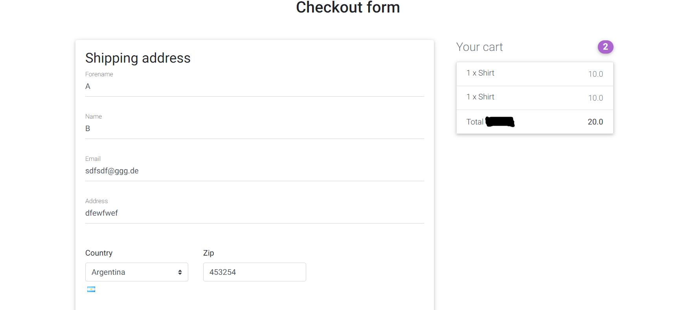

# ERC20-Token-E-Commerce-Shop

**ERC20-Token-E-Commerce-Shop** is an E-commerce platform that exclusively accepts payments via MetaMask. This project was born out of the need to create a platform where users could purchase products using a custom ERC20 token. The foundation for this project was an existing E-commerce shop that can be found here: [Django E-commerce](https://github.com/justdjango/django-ecommerce/tree/master/djecommerce). The core changes involved simplifying the design and eliminating conventional payment methods, transforming it into a streamlined merch shop.

## Table of Contents
- [General Information](#general-information)
- [Technologies Used](#technologies-used)
- [Key Features](#key-features)
- [Screenshots](#screenshots)
- [Setup](#setup)
- [Project Status](#project-status)
- [Room for Improvement](#room-for-improvement)
- [Acknowledgements](#acknowledgements)
- [Contact](#contact)

## General Information
**ERC20-Token-E-Commerce-Shop** is an online shop where users can log in solely using their MetaMask wallet and complete purchases with it. The login mechanism operates through a signature process, similar to the one explained here: [One-Click Sign-In Using MetaMask](https://www.quicknode.com/guides/web3-sdks/how-to-build-a-one-click-sign-in-using-metamask-with-phps-laravel). Understanding Web3 development is crucial to comprehend the inner workings of this platform.

The primary goal of this shop was to sell merchandise related to an NFT project. To be eligible for purchasing merchandise, users were required to possess an NFT from this specific project. This unique login system was necessary because it didn't rely on traditional username-password authentication; hence, it involved adapting Django's standard authentication process.

## Technologies Used
- Python
- Django
- HTML
- CSS
- JavaScript
- Web3

## Key Features
- Login with MetaMask wallet
- Payment with ERC20 tokens
- Order email notifications
- Shopping cart

## Screenshots

The first screenshot shows the main page where all products are listed (in this case one T-Shirt).

If you click on the Login-Button you will need to connect your MetaMask-Wallet with the web page. It's similar like in OpenSea. You just need to connect your wallet the first time you login.

For every login process you need to sign a signature. The signature process is like in: https://www.quicknode.com/guides/web3-sdks/how-to-build-a-one-click-sign-in-using-metamask-with-phps-laravel

After you logged in successfully, you will see, that the content of the login button changed. If you click on it, you can sign out.

If you click on the product on the main page, you will get to the product page. Here you can choose the size of the T-Shirt and add it to your cart.

In the cart you can see your whole order. Here you can decide the number of shirts as well.

If you want to checkout you need to specify your address.

The last process is the payment. The payment runs over MetaMask. As mentioned, you pay with ERC20-Tokens. The amount for your order is sent to the contract of the ERC-20 Token.

## Setup
You can start the project by running `python manage.py runserver`. You will likely need to provide credentials and your own smart contract ABIs. The backend was hosted using a MySQL Docker container, but you can use an SQLite database as an alternative. Please note that this project is not actively maintained, so some features may not work as expected. Feel free to use it as a source of inspiration.

My recommendation is to begin by understanding the [Django E-commerce code](https://github.com/justdjango/django-ecommerce/tree/master/djecommerce). Familiarize yourself with Django and how E-commerce platforms are typically built. Additionally, a grasp of Web3 development, JavaScript, Solidity, smart contracts, and their interaction is essential.

## Project Status
Project Status: _No longer actively worked on_

## Room for Improvement
Opportunities for improvement:
- Enhance the design and user interface
- Consider using modern front-end frameworks like React or Angular

To-Do:
- Implement a 'My Orders' page (similar to Amazon)
- ...

## Acknowledgements
- This project was inspired by an NFT project I started in 2022
- Many thanks to my team

## Contact
Created by [@toniju98](https://github.com/toniju98) - Feel free to contact me!

